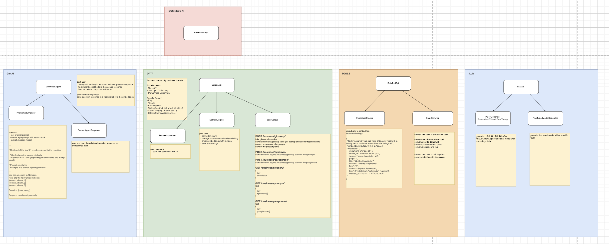

# 🧠 GenAI Corpus Suite – Modular System for Managing and Leveraging Domain Corpora for AI

This repository provides a full-stack architecture to **structure**, **transform**, **vectorize**, **query**, and **customize** business data for use with language models (LLMs).

Built to be **modular**, **scalable**, and **maintainable**, the GenAI Corpus Suite is designed to address real-world business needs with a strong focus on **efficiency** and **relevance**.

### 🚀 Key Benefits

✅ **Business-grade answers**: Responses are generated using **your domain-specific data** (FAQs, tickets, documents, visuals...) for maximum relevance and accuracy
💰 **Cost optimization**: Reduces the number of paid LLM API calls via intelligent caching and pre-prompt generation
⚡ **Faster responses**: Minimizes latency with a smart vector search and reusable response memory
🧠 **Smarter fine-tuning**: Adapts models using **parameter-efficient techniques** (LoRA, QLoRA…) to cut down training time and compute costs

Whether you’re building a **chatbot**, **semantic search engine**, or an **AI assistant tailored to your business**, GenAI Corpus Suite helps you **scale with control, precision, and impact**.

---

## 🏗️ Global Architecture – A Complete Pipeline for Leveraging Domain AI

1. 📥 Document ingestion and structuring: `CorpusApi`
2. 🔄 Data conversion and vectorization: `DataToolApi`
3. 🧪 Model customization: `LLMApi`
4. 💬 Intelligent answering: `OptimizedAgent`

Each component can work **independently** or in **synergy** with the others.

---

## ✨ Key Advantages

✅ **Modular** and **extensible** architecture
☁️ Compatible with **local or cloud-based** LLMs
⚙️ Resource optimization via **embeddings**, **caching**, and **lightweight fine-tuning**
🧩 Designed for business use cases: **customer support**, **document retrieval**, **chat agents**...

---

## 🤖 1. `OptimizedAgent` – Smart Agent with Memory and Context

Designed to respond to user queries quickly and accurately:

* 🗃️ Searches in a **vector cache** (`CachedAgentResponse`) to reuse validated answers.
* 🧠 Generates **enriched pre-prompts** (`PrepromptEnhancer`) if no relevant answer is found.

📈 The system dynamically adapts and **optimizes LLM calls**.

📄 [See the detailed documentation](docs/archi/GEN_AI.md)

---

## 📚 2. `CorpusApi` – Centralized Management of Business Corpus

This module organizes textual data in two layers:

* 📖 **`BaseCorpus`**: generic linguistic resources (glossary, synonyms, paraphrases).
* 🧩 **`DomainCorpus`**: supports business documents (FAQs, tickets, visual or technical documents), chunking, enrichment, vectorization.
* 🗂️ **Raw document storage**: allows for **replay**, **future regeneration**, and **direct link insertion** to sources in AI answers.

📄 [See the detailed documentation](docs/archi/DATA.md)

---

## 🧰 3. `DataToolApi` – Data Transformation and Vectorization

This API orchestrates two essential modules:

* 🔄 **`DataConverter`**: converts raw files (Markdown, Word, images, chats...) into usable **data chunks** or **FAQs**.
* 📐 **`EmbeddingsCreator`**: generates **semantic vectors** enriched with metadata for each segment.

🔍 This pipeline prepares data for **intelligent indexing** or **conversational exploitation**.

📄 [See the detailed documentation](docs/archi/TOOLS.md)

---

## 🧪 4. `LLMApi` – Efficient Fine-Tuning of Language Models

This component allows a LLM to be tailored to a business use case with minimal resources:

* 🧠 **`PETFGenerator`**: generates configurations for lightweight fine-tuning (LoRA, QLoRA, AdaLoRA...).
* 🛠️ **`FineTunedModelGenerator`**: applies these configurations to produce a **customized model**.

💡 Ideal for building **specialized models** without heavy computational loads.

📄 [See the detailed documentation](docs/archi/LLM.md)

---
